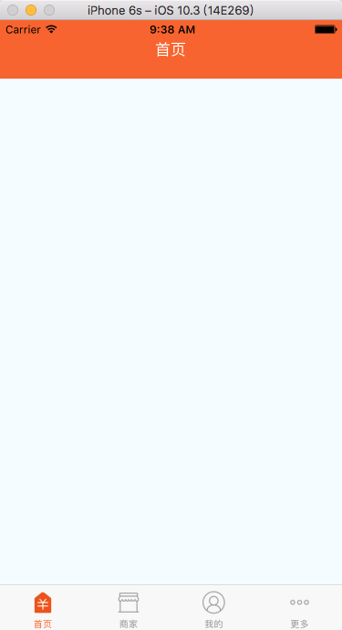
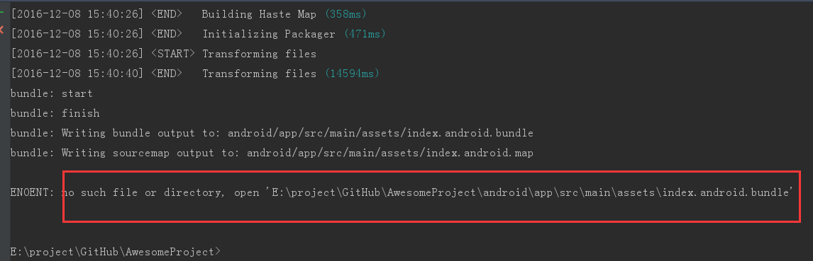
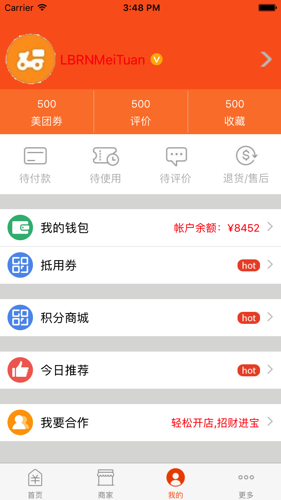

# LBRNMeiTuan
ReactNative 仿美团项目

1. 仿美团项目：首先设置标签栏和导航栏


```JavaScript

        var LBRNMain = React.createClass({

            getInitialState(){
              return {
                 selectedTab:'Home'
               }
            },
        render() {
              return (
                <TabNavigator>

                    {this.childNavigetor('首页','Home','icon_tabbar_homepage','icon_tabbar_homepage_selected','Home',LBRNHome)}
                    {this.childNavigetor('商家','EB','icon_tabbar_merchant_normal','icon_tabbar_merchant_selected','EB',LBRNEB)}
                    {this.childNavigetor('我的','Mine','icon_tabbar_mine','icon_tabbar_mine_selected','Mine',LBRNMine)}
                    {this.childNavigetor('更多','More','icon_tabbar_misc','icon_tabbar_misc_selected','More',LBRNMore)}
               </TabNavigator>
        );
        },

        childNavigetor(title,tabName,normalImage, selectedImage,componentName,component){
             return (
               <TabNavigator.Item
                    selectedTitleStyle={styles.selectedTextStyle}
                    selected={this.state.selectedTab === tabName}
                    title={title}
                    renderIcon={() => <Image source={{uri:normalImage}} style={styles.iconStyle} />}
                    renderSelectedIcon={() => <Image source={{uri:selectedImage}} style={styles.iconStyle} />}
                    onPress={() => this.setState({ selectedTab: componentName })}>
                    <Navigator
                       initialRoute={{ name: componentName, component: component }}
                       configureScene={(route) => {
                       return Navigator.SceneConfigs.PushFromRight;
                       }}
                       renderScene={(route, navigator) => {
                       let Component = route.component;
                       return <Component {...route.props} navigator={navigator} />
                       }}
                    />

             </TabNavigator.Item>
            )
          }
        })

        const styles = StyleSheet.create({
            container: {
                flex: 1,
                justifyContent: 'center',
                alignItems: 'center',
                backgroundColor: '#F5FCFF',
              },
            iconStyle:{
                width:28,
                height:28
            },
                selectedTextStyle:{
                color:'#fb6320'
            }
        });

        module.exports = LBRNMain;

```
2. 加载启动图片： 
   核心代码：
```JavaScript

        var LBRNLaunchImage = React.createClass({

            render(){
               return(

                 <Image source={{uri:'welcome.png'}} style={styles.container} />
               )
            },
            //增加定时器、请求网络数据
            componentDidMount(){
              setTimeout(()=>{
              this.props.navigator.replace({
              component:LBRNMain
              })
              },1000)
            }
        })

        const styles=StyleSheet.create({
           container:{
           flex:1
          }
        })

        module.exports=LBRNLaunchImage;

```
3. 更多模块
   * 错误解决
   
   解决办法：
   cd进入项目根目录执行如下安装命令：
   ```
   react-native bundle --platform android --dev false --entry-file index.android.js --bundle-output android/app/src/main/assets/index.android.bundle --assets-dest android/app/src/main/res/
   ```
   * 正确截图：
  
   * 错误截图
  

4. 导入文件：* ```第一种方式
             import SmallMiddleView from './SmallMiddleView.js';
             ```
 
           * ```第二种方式
             SmallMiddleView = require('SmallMiddleView');
             ```
5. 导航栏图片：定位position

6. 传值

7. 我的模块： 
  


=======================

  #### 如有更好的建议请联系:<2281075105@qq.com>

  #### 想看更多开源项目请点击：[Github地址](https://github.com/lb2281075105)
