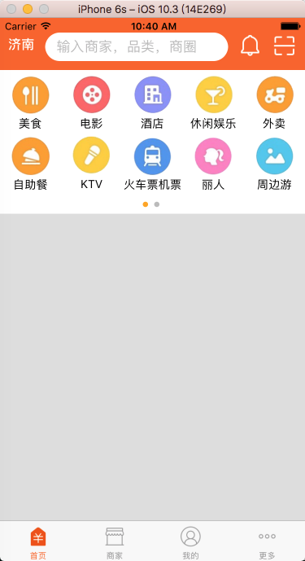
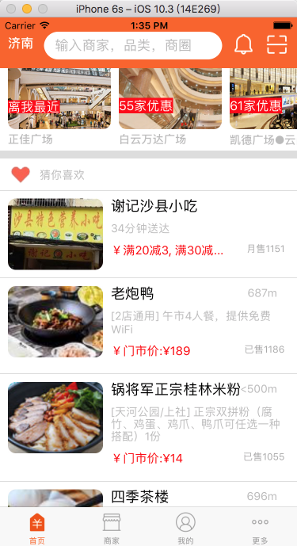

# LBRNMeiTuan
ReactNative 仿美团项目

1. 仿美团项目：首先设置标签栏和导航栏


核心代码：
```JavaScript

        var LBRNMain = React.createClass({

            getInitialState(){
              return {
                 selectedTab:'Home'
               }
            },
        render() {
              return (
                <TabNavigator>

                    {this.childNavigetor('首页','Home','icon_tabbar_homepage','icon_tabbar_homepage_selected','Home',LBRNHome)}
                    {this.childNavigetor('商家','EB','icon_tabbar_merchant_normal','icon_tabbar_merchant_selected','EB',LBRNEB)}
                    {this.childNavigetor('我的','Mine','icon_tabbar_mine','icon_tabbar_mine_selected','Mine',LBRNMine)}
                    {this.childNavigetor('更多','More','icon_tabbar_misc','icon_tabbar_misc_selected','More',LBRNMore)}
               </TabNavigator>
        );
        },

        childNavigetor(title,tabName,normalImage, selectedImage,componentName,component){
             return (
               <TabNavigator.Item
                    selectedTitleStyle={styles.selectedTextStyle}
                    selected={this.state.selectedTab === tabName}
                    title={title}
                    renderIcon={() => <Image source={{uri:normalImage}} style={styles.iconStyle} />}
                    renderSelectedIcon={() => <Image source={{uri:selectedImage}} style={styles.iconStyle} />}
                    onPress={() => this.setState({ selectedTab: componentName })}>
                    <Navigator
                       initialRoute={{ name: componentName, component: component }}
                       configureScene={(route) => {
                       return Navigator.SceneConfigs.PushFromRight;
                       }}
                       renderScene={(route, navigator) => {
                       let Component = route.component;
                       return <Component {...route.passProps} navigator={navigator} />
                       }}
                    />

             </TabNavigator.Item>
            )
          }
        })

        const styles = StyleSheet.create({
            container: {
                flex: 1,
                justifyContent: 'center',
                alignItems: 'center',
                backgroundColor: '#F5FCFF',
              },
            iconStyle:{
                width:28,
                height:28
            },
                selectedTextStyle:{
                color:'#fb6320'
            }
        });

        module.exports = LBRNMain;

```
2. 加载启动图片： 

核心代码：
```JavaScript

        var LBRNLaunchImage = React.createClass({

            render(){
               return(

                 <Image source={{uri:'welcome.png'}} style={styles.container} />
               )
            },
            //增加定时器、请求网络数据
            componentDidMount(){
              setTimeout(()=>{
              this.props.navigator.replace({
              component:LBRNMain
              })
              },1000)
            }
        })

        const styles=StyleSheet.create({
           container:{
           flex:1
          }
        })

        module.exports=LBRNLaunchImage;

```
3. 更多模块
   * 错误解决
   
   解决办法：
   cd进入项目根目录执行如下安装命令：
   ```
   react-native bundle --platform android --dev false --entry-file index.android.js --bundle-output android/app/src/main/assets/index.android.bundle --assets-dest android/app/src/main/res/
   ```
   * 正确截图：
  
   * 错误截图
  

4. 导入文件：* ```第一种方式
             import SmallMiddleView from './SmallMiddleView.js';
             ```
 
           * ```第二种方式
             SmallMiddleView = require('SmallMiddleView');
             ```
5. 导航栏图片：定位position

6. 传值

7. 我的模块： 
  

8. 商家模块：
  

9. 首页上部视图：
  

> 组件式开发

核心代码：
```JavaScript
    // 当滚动动画结束之后调用此回调
    onScrollAnimationEnd(event){
         // Math.floor(x)获取不大于x的最大整数
         var page = Math.floor(event.nativeEvent.contentOffset.x/width);
         console.log(page);
         this.setState({
         currentPage:page
      })
    },
    renderScrollViewMethod(){
         var dataCount = homeTopMenuData;
         var array = [];
         for (var i=0;i<dataCount.length;i++){
            array.push(
               <LBRNHomeTopListView
                  dataArray={homeTopMenuData[i]}
                  key={i}
               />
             )
          }
          return array;
    },
    indicatorMethod(){
         var colorsArray = [], bullColor;
         //&bull; 圆点
         for(var i=0;i<2;i++){
               bullColor = i == this.state.currentPage ? 'orange' : '#bbb';
               colorsArray.push(
                 <Text style={[{fontSize:22,paddingRight:3}, style={color:bullColor}]} key={i}>&bull;</Text>
               )
         }
         return colorsArray;
     }
==============================================
    var LBRNHomeTopListView = React.createClass({
         getDefaultProps(){
            return{
               dataArray:[]
           }
         },
         getInitialState(){
            let ds = new ListView.DataSource({rowHasChanged: (r1, r2) => r1 !== r2});
            return{
               dataSource : ds.cloneWithRows(this.props.dataArray)
             }
          },
        render(){
            return(
               <View>
                  <ListView
                      dataSource={this.state.dataSource}
                      renderRow={this.renderRow}
                      contentContainerStyle={styles.contentStyle}
                      scrollEnabled={false}//设置ListView不滑动
                   />

              </View>
            )
         },
        //cell
        renderRow(rowData){
            return(
               <View style={{width:imageWH,height:imageWH,justifyContent:'center',alignItems:'center'}}>
                  <Image source={{uri:rowData.image}} style={{width:imageWH - 20,height:imageWH - 20}}/>
                  <Text>{rowData.title}</Text>
               </View>
            )
           }
     })
```
注意事项：
```JavaScript
    // 底部如果是ScrollView,那么根节点就是ScrollView,不要把根节点设置为View
    <ScrollView>
         <LBRNHomeTopView

         />
    </ScrollView>

    <ListView
         dataSource={this.state.dataSource}
         renderRow={this.renderRow}
         contentContainerStyle={styles.contentStyle}
         scrollEnabled={false}
     />

    // 要使ListView换行,要设置ListView宽度
    contentStyle:{
         flexDirection:'row',
         flexWrap:'wrap',
         width:width
    }

```

10. 首页中间组件以及购物中心组件：


> 组件式开发

核心代码：
```JavaScript

    var LBRNHomeShopCenterView = React.createClass({
        getDefaultProps(){
             return{
                dataArray:[]
             }
        },
        getInitialState(){
             let dataSource = new ListView.DataSource({rowHasChanged:(row1,row2) => row1 !== row2});
             return{
               dataSource:dataSource.cloneWithRows(this.props.dataArray)
            }
        },
        render(){
             return(
                <ListView
                  dataSource={this.state.dataSource}
                  renderRow={this.renderCenterRow}
                  contentContainerStyle={styles.contentStyle}
        />

    )
    },
    //cell
    renderCenterRow(rowData,sectionID,rowID){
           var imageMarginRight = 0;

          if (this.props.dataArray.length-1 == rowID){
              imageMarginRight = 10;
          }
          return(
         <View >
            <View style={styles.container}>
            <Image source={{uri:rowData.img}} style={{width:130,height:97,borderRadius:10,marginRight:imageMarginRight}}/>
            <Text style={{color:'white',position:'absolute',bottom:20,backgroundColor:'red',fontSize:16}}>{rowData.showtext.text}</Text>

         </View>

         <View >
             <Text style={{fontSize:14,fontWeight:'bold', color:'#bbb',marginTop:5,marginLeft:10,marginBottom:5}}>{rowData.name}</Text>
             </View>
         </View>
      )
     }
    })
    const styles = StyleSheet.create({
          container:{
              backgroundColor:'white',
              marginLeft:10
          },
          contentStyle:{
              flexDirection:'row',
         }
    })
    module.exports=LBRNHomeShopCenterView;
```

11. 购物中心详情：

    购物中心详情：回调函数，逆向传值或者是正向传值

   

> 组件式开发

核心代码：
```JavaScript

    getDefaultProps(){
         return{
           dataArray:[],
           popToHome:null
    }
    },

    urlMethod(url){
         ///处理url
        var httpUrl=url.replace('imeituan://www.meituan.com/web/?url=','');

        if (httpUrl == null)return;
        this.props.popToHome(httpUrl);
        //AlertIOS.alert(httpUrl);
    }

    <LBRNHomeShopCenterView
        dataArray={homeShopCenter.data}
        popToHome={(url)=>this.popToHome(url)}///回调函数
    />

    <WebView
        automaticallyAdjustContentInsets={true}
        source={{uri: this.state.detailUrl}}
        javaScriptEnabled={true}
        domStorageEnabled={true}
        decelerationRate="normal"
        startInLoadingState={true}
    />

```
12. 热门中心：和购物中心类似

13. 猜你喜欢：

    猜你喜欢：回调函数，逆向传值或者是正向传值

    

> 组件式开发

核心代码：
```JavaScript
    dataMethod(){
          fetch(this.props.api_url)
           .then((responder)=>responder.json())
           .then(responderData=>{
              this.setState({dataSource:this.state.dataSource.cloneWithRows(responderData.data)})
           })
          .catch((error) => {
             this.setState({dataSource:this.state.dataSource.cloneWithRows(homeBottomData.data)})
         });
    }

    dealWithUrl(url){

        if (url.search('w.h') == -1){
           return url.replace('.webp','');
        }else {
          return url.replace('w.h','120.90')
        }
    }

```
=======================

  #### 如有更好的建议请联系:<2281075105@qq.com>

  #### 想看更多开源项目请点击：[Github地址](https://github.com/lb2281075105)

## 学习心得
   第一次学习ReactNative开发，感觉编写代码心里很舒畅，用JSX语句开发App，很爽快，自学ReactNative，有时间看看ReactNative中文网站资源，就拿`美团`作为练手项目，也是第一个在github上面开源项目，接下来也会深入学习，写更多的开源项目来提升自己的能力。
